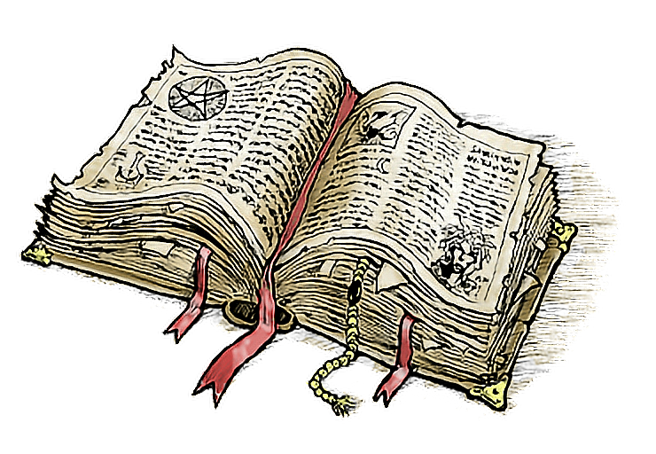

# Libro degli incantesimi

## Indice

[toc]

## Trucchetti

### Caos Mentale

*Trucchetto di ammaliamento*

| Tempo di lancio | Gittata  | Componenti | Durata  |
| --------------- | -------- | ---------- | ------- |
| 1 azione        | 18 metri | V          | 1 round |

Inietti un picco di energia caotica nella mente di una creatura entro gittata. Il bersaglio deve effettuare un tiro salvezza su Intelligenza o ricevere 1d6 danni psichici e rimuovere 1d4 dal prossimo tiro salvezza effettuato prima della fine del tuo prossimo turno.

**Ai Livelli Superiori**. I danni di questo incantesimo aumentano di 1d6 quando raggiungi i seguenti livelli: 5° livello (2d6), 11° livello (3d6), e 17° livello (4d6). 

### Dardo di Fuoco

*Trucchetto di Invocazione*

| Tempo di lancio | Gittata  | Componenti | Durata     |
| --------------- | -------- | ---------- | ---------- |
| 1 azione        | 36 metri | V, S       | Istantanea |

L'incantatore scaglia una scintilla di fuoco verso una creatura o un  oggetto situato entro gittata, effettuando un attacco a distanza con  questo incantesimo contro il bersaglio.

Se colpisce, il bersaglio subisce 1d10 danni da fuoco.

Un oggetto infiammabile colpito da questo incantesimo si incendia se non è indossato o trasportato.

**Ai Livelli Superiori**. I danni di questo incantesimo aumentano di 1d10 quando  l'incantatore arriva al 5° livello (2d10), 11° livello (3d10) e 17°  livello (4d10).

### Mano Magica

*Trucchetto di Evocazione*

| Tempo di lancio | Gittata | Componenti | Durata   |
| --------------- | ------- | ---------- | -------- |
| 1 azione        | 9 metri | V,S        | 1 minuto |

Una mano spettrale e fluttuante appare nel punto scelto all'interno  del raggio. La mano dura per la durata o fino a quando non la scartate  come azione. La mano svanisce se è mai più di 9 metri di distanza da te o se lanci di nuovo questo incantesimo.

Puoi usare la tua azione per controllare la mano. Puoi usare la  mano per manipolare un oggetto, aprire una porta o un contenitore  sbloccato, riporre o recuperare un oggetto da un contenitore aperto o  versare il contenuto da una fiala. Puoi muovere la mano fino a 9 metri  ogni volta che la usi.

La mano non può attaccare, attivare oggetti magici o trasportare più di 5 chili.

### Prestidigitazione

*Trucchetto di Trasmutazione*

| Tempo di lancio | Gittata | Componenti | Durata       |
| --------------- | ------- | ---------- | ------------ |
| 1 azione        | 3 metri | V,S        | Fino a 1 ora |

Questo incantesimo è un trucco magico che gli incantatori novizi  usano per fare pratica. L'incantatore crea uno degli effetti magici  seguenti entro gittata:

- Crea un effetto sensoriale innocuo e istantaneo, come una  pioggia di scintille, una folata di vento, una tenue melodia musicale o  uno strano odore.
- Accende o spegne istantaneamente una candela, una torcia o un piccolo fuoco da campo.
- Pulisce o sporca istantaneamente un oggetto non più grande di un cubo con spigolo di 30 cm.
- Riscalda, raffredda o condisce materiale non vivente del volume massimo di un cubo di spigolo di 30 cm per 1 ora.
- Fa comparire un colore, un piccolo segno o un simbolo su un oggetto o una superficie per 1 ora.
- Crea un ninnolo non magico o un'immagine illusoria che può stare nella sua mano e che permane fino alla fine del suo turno.

Se l'incantatore lancia questo incantesimo più volte può tenere  attivi fino a tre dei suoi effetti non istantanei contemporaneamente, e  può congedare ognuno di questi effetti con un'azione.

### Raggio di Gelo

*Trucchetto di Invocazione*

| Tempo di lancio | Gittata  | Componenti | Durata     |
| --------------- | -------- | ---------- | ---------- |
| 1 azione        | 18 metri | V,S        | Istantanea |

Un raggio gelido di luce azzurra e biancastra sfreccia verso una creatura entro gittata.

L'incantatore effettua un attacco a distanza con questo incantesimo contro il bersaglio.

Se lo colpisce, il bersaglio subisce 1d8 danni da freddo e la sua velocità è ridotta di 3 metri fino all'inizio del turno successivo  dell'incantatore.

**Ai Livelli Superiori**. I danni di questo incantesimo aumentano di 1d8 quando  l'incantatore arriva al 5° livello (2d8), 11° livello (3d8) e 17°  livello (4d8).

## 1° Livello

> ⚠ Aggiungere un'incantesimo qui

### Dardo di Caos

*Invocazione di 1° livello*

| Tempo di lancio | Gittata  | Componenti | Durata     |
| --------------- | -------- | ---------- | ---------- |
| 1 azione        | 36 metri | V,S        | Istantanea |

L'incantatore scaglia una massa tremolante e gorgogliante di energia  caotica contro una creatura entro gittata, effettuando un attacco con  incantesimo a distanza contro il bersaglio. Se lo colpisce, il bersaglio subisce 2d8 + 1d6 danni. L' incantatore sceglie uno dei d8. Il  risultato ottenuto col tiro di quel dado determina il tipo di danno  dell'attacco, come indicato di seguito.

1. Acido
2. Forza
3. Freddo
4. Fulmine
5. Fuoco
6. Psichico
7. Tuono
8. Veleno 

Se l'incantatore ottiene lo stesso risultato con entrambi i d8,  l'energia caotica balza dal bersaglio a una creatura diversa a scelta  dell'incantatore situata entro 9 metri da esso. L'incantatore effettua  un nuovo tiro per colpire contro il nuovo bersaglio e un nuovo tiro per i danni, che potrebbe far balzare di nuovo l'energia caotica. Una  creatura può essere bersagliata soltanto una volta da ogni lancio di  questo incantesimo.

**Ai Livelli Superiori**. Quando l'incantatore lancia questo  incantesimo usando uno slot incantesimo di 2° livello o superiore, ogni bersaglio subisce 1d6 danni extra del tipo ottenuto con il tiro per  ogni slot di livello superiore al 1°.

### Scudo

*Abiurazione di 1° livello*

| Tempo di lancio | Gittata     | Componenti | Durata  |
| --------------- | ----------- | ---------- | ------- |
| 1 reazione\*     | Incantatore | V, S       | 1 round |

Una barriera di forza magica invisibile si materializza e protegge l'incantatore.

Fino all'inizio del proprio turno successivo, l'incantatore ottiene un bonus +5 alla CA da applicare anche all'attacco innescante e non subisce danni dall'incantesimo *Dardo Incantato*. 

\* che l'incantatore effettua quando è colpito da un attacco o bersagliato dall'incantesimo *Dardo Incantato*.

### Spruzzo Colorato

*Illusione di 1° livello*

| Tempo di lancio | Gittata                    | Componenti                                                   | Durata  |
| --------------- | -------------------------- | ------------------------------------------------------------ | ------- |
| 1 azione        | Incantatore (cono di 4,5m) | V, S, M (un pizzico di sabbia o di polvere colorata di rosso, giallo e blu) | 1 round |

Dalla mano dell'incantatore si sprigiona un lampo abbagliante di luce multicolore. L'incantatore tira 6d10; il totale indica l'ammontare di  creature in punti ferita che questo incantesimo può influenzare. Le  creature situate entro un cono di 4,5 metri che ha origine  dall'incantatore sono influenzate in ordine crescente basato sui loro  punti ferita attuali (ignorando le creature prive di sensi e quelle che  non sono in grado di vedere).

A partire dalla creatura che possiede meno punti ferita attuali,  ogni creatura influenzata da questo incantesimo è accecata finché  l'incantesimo non termina. Si sottraggono i punti ferita di ogni  creatura dal totale prima di passare alla creatura con l'ammontare  immediatamente superiore di punti ferita. I punti ferita di una creatura devono essere pari o inferiori al totale rimanente affinché quella  creatura possa essere influenzata.

**Ai Livelli Superiori.** Quando l'incantatore lancia questo  incantesimo usando uno slot incantesimo di 2° livello o superiore, tira  2d10 aggiuntivi per ogni slot di livello superiore al 1°.

## Template

| Tempo di lancio | Gittata | Componenti | Durata |
| --------------- | ------- | ---------- | ------ |
|                 |         |            |        |
